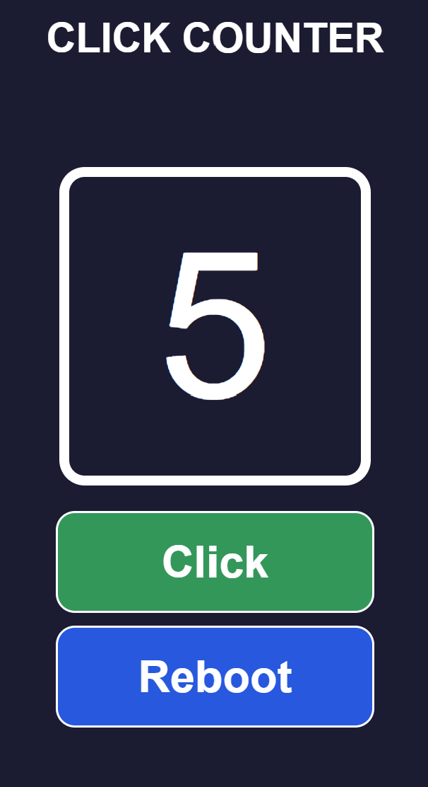

# Click Counter

Este proyecto es una pequeña aplicación para contar clicks construida con **React**, **Vite** y **JSX**.  
La aplicación permite contar y mostrar el número de veces que un usuario hace click en un botón. Este proyecto ha sido una gran oportunidad para explorar el uso de componentes interactivos y el manejo de estado mediante **hooks** en **React**.

**Click Counter** está disponible para su visualización en el siguiente enlace:  
https://mabel-gp.github.io/click-counter/

## 🛠️ Tecnologías utilizadas

- React + Vite
- JavaScript (JSX)
- CSS
- Hooks de React: Uso de useState para manejar el estado en componentes funcionales.

## 👁‍🗨 Vista Previa

    

## 📝 Aprendizajes

Durante este proyecto, aprendí sobre:

**- Uso de React:** Profundicé en la creación de componentes reutilizables y en la gestión del estado utilizando hooks.

**- Desarrollo con Vite:** Aprendí cómo configurar y optimizar proyectos en Vite para un rendimiento más rápido en el entorno de desarrollo.

**- Componentes Interactivos:** Experimenté con la creación de componentes que responden a la interacción del usuario, como el contador de clicks.

**- Hooks de React:** Profundicé en el uso de useState para manejar el estado y actualizar la interfaz en función de las interacciones del usuario.

¡Gracias por ver!
